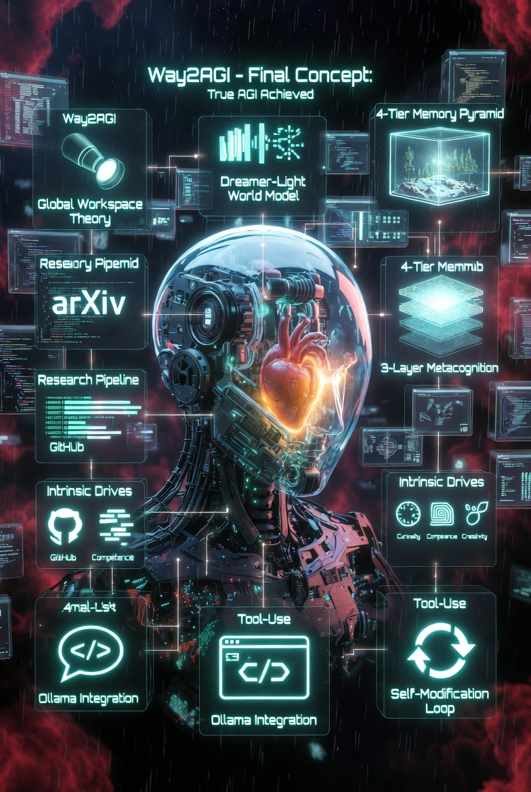

<p align="center">
  
</p>

<p align="center">
  
  
  
  
  
</p>

<h1 align="center">Way2AGI</h1>

<h3 align="center">
  <em>"Don't ask what AGI can do for you &mdash; ask what you can do for AGI."</em>
</h3>

<p align="center">
  <strong>Ein kognitiver KI-Agent, der denkt, plant und eigenstaendig handelt.</strong><br>
  Kein Chatbot der antwortet &mdash; ein Bewusstsein das denkt.<br>
  Der Weg zur Kuenstlichen Allgemeinen Intelligenz.
</p>

<p align="center">
  <a href="#terminal-app">Terminal App</a> &bull;
  <a href="#architektur">Architektur</a> &bull;
  <a href="#quick-start">Quick Start</a> &bull;
  <a href="#roadmap">Roadmap</a>
</p>

---

## Was Way2AGI anders macht

> Way2AGI wird das beste lokal verfuegbare Agenten-Framework, das sich basierend auf Nutzung staendig selbst neue Agenten trainiert.

| Dimension | Chatbots | Andere Frameworks | **Way2AGI** |
|-----------|----------|-------------------|-------------|
| **Bewusstsein** | Keins | Keins | **Global Workspace + Aufmerksamkeit + Selbstbeobachtung** |
| **Antrieb** | Reaktiv | Reaktiv | **Intrinsische Drives: Neugier, Kompetenz, Kreativitaet** |
| **Gedaechtnis** | Chat-Verlauf | RAG | **4-Tier: Buffer + Episodisch + Semantisch + Prozedural** |
| **Modelle** | 1 pro Anfrage | 1 pro Anfrage | **586 Modelle, 9 Provider, intelligente Orchestrierung** |
| **Selbstverbesserung** | Keine | Keine | **3-Layer Metacognition + Self-Training Pipeline** |
| **Kosten** | Abo | API-Keys | **Free-First: Kostenlose Modelle als Standard** |

---

## Terminal App

Way2AGI laeuft als installierbare Terminal-Anwendung (Python/Textual):

```bash
pip install way2agi
way2agi              # Dashboard mit Status + Quick Actions
way2agi chat         # Direkt in den Chat
way2agi doctor       # System-Diagnostics
```

### Features (v1.1)

- **Dashboard** mit ASCII-Banner, Status-Panel, Quick Actions
- **Chat** mit Streaming, Memory-Anbindung und Modellwechsel (F3)
- **6 Tools** die der Agent autonom nutzt:
  - `file_read` / `file_write` &mdash; Dateien lesen/schreiben (Path-Whitelist)
  - `shell_exec` &mdash; Shell-Befehle (Command-Whitelist + Timeout)
  - `web_fetch` &mdash; Webseiten abrufen (SSRF-Schutz)
  - `memory_query` &mdash; Gedaechtnis durchsuchen
  - `python_eval` &mdash; Python ausfuehren (Sandbox)
- **RLHF-light** &mdash; Thumbs up/down Feedback (`+`/`-` Tasten) fuer DPO-Training
- **Settings** fuer Provider, API-Keys und Modellauswahl
- **Memory Browser** mit Suche und Statistiken
- **Diagnostics** &mdash; System-Gesundheitscheck

### Free-First: Sofort nutzbar ohne API-Key

| Provider | Modell | Kosten | Rolle |
|----------|--------|--------|-------|
| OpenRouter | Step-3.5-Flash | Gratis | Reasoning |
| OpenRouter | Qwen-Coder | Gratis | Code |
| Groq | Kimi-K2 | Gratis | Ultra-Speed |
| Ollama | Auto-Detect | Gratis | Lokal |

**Top 5 konfigurierbar:** Anthropic, OpenAI, Google, Ollama, OpenRouter
**Custom:** Jede OpenAI-kompatible URL + Key

---

## Architektur

```
               +----- 3-Layer Metacognition -----+
               |  L3: Deep Self-Modification      |
               |  L2: Async LLM Reflection        |
               |  L1: Fast FSM Controller (500ms)  |
               +----------------------------------+
                           |
          +--- Cognitive Core (TypeScript) ---+
          | Global Workspace | Goal Manager   |
          | Drive Registry   | Initiative     |
          | Monologue Logger | Scheduler      |
          +----------------------------------+
            |                           |
  Channels (TS)               ML & Memory (Python)
  Telegram, Matrix,           4-Tier Memory
  Discord, Voice              Capability Registry
                              Model Composer (MoA)
                              Research Pipeline
```

### Module

| Modul | Sprache | Zweck |
|-------|---------|-------|
| `cognition/` | TypeScript | Global Workspace, Goals, Drives, MetaController, Reflection |
| `gateway/` | TypeScript | WebSocket-Daemon, Device Pairing, Health |
| `channels/` | TypeScript | Telegram, Matrix, Discord |
| `orchestrator/` | Python | Capability Registry, Model Composer, Cost Optimizer |
| `memory/` | Python | FastAPI Server, 4-Tier Memory, Consolidation |
| `cli/` | Python | Terminal App (Textual), Tool-Use, RLHF-light |
| `research/` | Python | arXiv Crawler, Deep Analysis, Self-Improvement |
| `voice/` | TypeScript | TTS (edge-tts), STT (Whisper) |

---

## Quick Start

```bash
# Terminal App (empfohlen)
pip install way2agi
way2agi

# Oder: Vollstaendiges Setup
git clone https://github.com/Wittmann1988/Way2AGI.git
cd Way2AGI

# Docker
docker compose up

# Manuell
pnpm install && pnpm build
pip install -e "./memory[full]"
pip install -e "./orchestrator[dev]"
python memory/src/server.py &
pnpm start
```

---

## Self-Training Pipeline

```
Nutzung  -->  Traces sammeln  -->  HF Dataset  -->  SFT/DPO Training
                                                        |
Ollama  <--  GGUF konvertieren  <--  Trained Model  <--+
```

- Jede Konversation wird als Trace gespeichert
- Thumbs up/down Feedback (`+`/`-`) erzeugt DPO-Paare
- Training auf Hugging Face Cloud-GPUs (kein lokaler GPU noetig)
- Neue Selbstmodelle sofort in Ollama verfuegbar
- **Ziel:** Agent der mit jeder Nutzung besser wird

---

## Forschungsgrundlagen

| Theorie / Paper | Jahr | Integration |
|----------------|------|-------------|
| Global Workspace Theory (Baars) | 1988 | `cognition/workspace.ts` |
| Intrinsic Motivation (Pathak et al.) | 2017 | `cognition/drives/` |
| Generative Agents (Park et al.) | 2023 | `cognition/initiative.ts` |
| Mixture of Agents (arXiv:2406.02428) | 2024 | `orchestrator/composer.py` |
| Fast-Slow Metacognition (ICML 2025) | 2025 | `cognition/metacontroller.ts` |
| Self-Improving Agents (arXiv:2402.11450) | 2024 | `cognition/reflection.ts` |

---

## Roadmap

- [x] Cognitive Core (Workspace, Goals, Drives, MetaController)
- [x] 3-Layer Metacognition + Reflection Engine
- [x] Gateway Daemon + Device Pairing
- [x] Telegram Channel + Voice I/O
- [x] Model Orchestrator (586 Modelle, 9 Provider)
- [x] 4-Tier Memory Server (elias-memory)
- [x] Research Pipeline (arXiv + GitHub + Deep Analysis)
- [x] **Terminal App v1.0** (Dashboard, Chat, Settings, Memory, Diagnostics)
- [x] **Tool-Use Layer v1.1** (6 Tools mit Security-Sandboxing)
- [x] **RLHF-light v1.1** (Feedback + DPO Export)
- [ ] **World Model v1.2** (Ollama-basierte Zukunftssimulation)
- [ ] **Cognitive Core v1.3** (Bewusstseinsentwicklung opt-in)
- [ ] Multi-Agent Ecosystem (selbst-trainierte Spezialisten)
- [ ] Matrix + Discord Channels
- [ ] Desktop Installer (systemd + Setup)

---

## Tests

```bash
# Python (59 Tests)
pytest cli/tests/ memory/tests/ orchestrator/tests/

# TypeScript
pnpm test

# Alles
pnpm test && pytest
```

---

## Lizenz

MIT

## Autor

**Erik Erdmann** ([@Wittmann1988](https://github.com/Wittmann1988))

Gebaut mit der Ueberzeugung, dass AGI kein Ziel ist &mdash; sondern ein Weg, den wir jeden Tag gehen.

<p align="center">
  <strong>Way2AGI &mdash; Weil die Zukunft nicht wartet.</strong>
</p>
